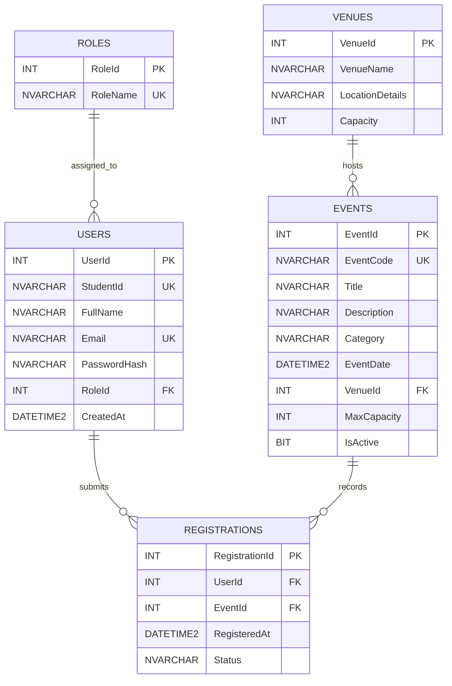

# SUBMISSION

**Project:** Online Campus Event Management System
**Course:** Applied Generative AI for IT Solution Development — Group Hands-On Laboratory Examination

## Team Roster

| Member | Name | Assigned Role | Core Responsibilities |
|--------|------|---------------|-----------------------|
| Member 1 | Matthew | Systems Architect & Prompt Lead | Task 1 (Requirements & Prompt Engineering) + Task 5 (Documentation & Integration) |
| Member 2 | James | Frontend Engineer | Task 2 (AI-Assisted UI & WCAG Accessibility) |
| Member 3 | Harvey | Database & Backend Engineer | Task 3 (3NF Schemas, Mermaid.js ERD & SQL Scripts) |
| Member 4 | John | QA & Security Engineer | Task 4 (Shift-Left Unit Testing & Vulnerability Refactoring) |

## Setup Instructions

1. [Clone the repository: `git clone [repository URL]`]
2. [Frontend: open `/frontend/index.html` in a browser.]
3. [Database: run `/database/schema.sql` against [SQL Server / target DB].]
4. Tests: run `node --test frontend/script.test.js`. The backend source requires a .NET project referencing `Microsoft.Data.SqlClient` and a configured SQL Server connection string.

## Deliverables

| Task | Deliverable | Location |
|------|-------------|----------|
| Task 1 | RCTC prompts, AI outputs, grounding evaluation | [docs/prompts.md](docs/prompts.md) |
| Task 2 | Event Catalog & Registration Form UI | [frontend/](frontend/) |
| Task 3 | 3NF schema, Mermaid.js ERD, DDL script | [database/schema.sql](database/schema.sql) |
| Task 4 | Unit tests and refactored registration service | [backend/RegistrationService.cs](backend/RegistrationService.cs) |
| Task 5 | Group verification log | [docs/verification-logs.md](docs/verification-logs.md) |

## Task 1: Requirements Analysis & Prompt Architecture

The full RCTC prompts table, exact AI outputs, and manual grounding evaluation are in [docs/prompts.md](docs/prompts.md).

## Task 2: AI-Assisted Frontend Development

UI code is in [frontend/](frontend/).

[Brief notes on the AI tool used, semantic HTML5 structure, and WCAG features implemented.]

## Task 3: Database Design & ERD Generation

DDL script: [database/schema.sql](database/schema.sql)

### Entity-Relationship Diagram

The `ROLES` entity establishes a one-to-many relationship with `USERS`, allowing role-based access control between students and administrators without duplicating authorization metadata. `VENUES` and `EVENTS` maintain a one-to-many relationship where venue capacity and location are stored independently of specific event schedules to eliminate update anomalies. `REGISTRATIONS` functions as a fully normalized associative entity bridging `USERS` and `EVENTS` in a many-to-many structure, ensuring attendee profiles and event capacities are referenced via foreign keys rather than redundant derived columns.

## Task 4: Shift-Left Testing, Security & Refactoring

- Refactored solution: [backend/RegistrationService.cs](backend/RegistrationService.cs)
- Unit tests: [frontend/script.test.js](frontend/script.test.js)

The original query concatenated email into SQL, referenced an `Email` column absent from `Registrations`, and did not dispose its connection or command. The refactored [RegistrationService](backend/RegistrationService.cs) joins `Users` to `Registrations`, uses a typed SQL parameter, and disposes the connection, command, and reader. It returns a list because a user may have multiple registrations; no matches produce an empty list.

## Task 5: Group Integration & Verification Report

### AI Disclosure Statement

AI tool used: Claude Code (Claude Opus 5.5) in VS Code, for the frontend prompts (Prompts 1-4). [Confirm tool and version used for Prompts 5-9 (schema, DDL, unit tests, C# refactor, security review).]

How outputs were verified:
- **Frontend (James):** validation logic was run in Node against valid and invalid cases; all 55 light/dark color pairs were checked with a WCAG contrast script; the cards and filters were driven in headless Microsoft Edge and checked in light and dark mode. Lighthouse and a keyboard-only pass are still to do.
- **Database (Harvey):** the schema was checked against 1NF, 2NF and 3NF, every foreign key was confirmed to have a non-clustered index, and the CHECK and UNIQUE constraints and the attendee query were reviewed.
- **Testing and security (John):** 12 unit tests were run with `node --test frontend/script.test.js` and all pass; the refactored C# service compiled in a temporary .NET 9 project. No live SQL Server query was run, so database execution is unverified.

### Group Verification Log

The full verification log table is in [docs/verification-logs.md](docs/verification-logs.md).
