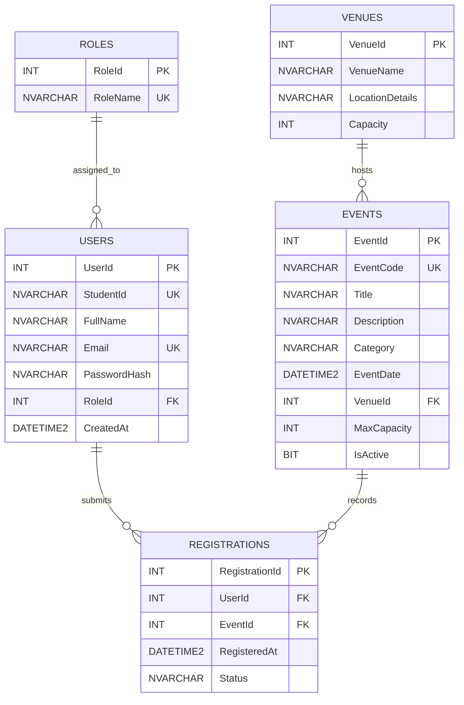

# SUBMISSION

## Task 1: Requirements Analysis & Prompt Architecture

**Lead:** Member 1 (Systems Architect) **Duration:** 30 Minutes **Points:** 20

### 1. Production-Grade RCTC Prompts

Use the table below to document the production-grade prompts created using the **Role–Context–Task–Constraints (RCTC)** framework. Each row should correspond to **one prompt assigned to one member**.

| # | Assigned Member | Role / Persona | Context | Task | Constraints |
|---|-----------------|----------------|---------|------|-------------|
| 1 | Member 2 (Frontend Engineer) | Senior Frontend Engineer focused on accessible (WCAG 2.1 AA) web UI | Lab midterm, Online Campus Event Management System; Task 2 needs an Event Catalog + Registration Form in /frontend, using a given navy/blue color palette | Build a static HTML/CSS/JS prototype: event catalog, registration form, and a simple admin attendee list | Semantic HTML5 (header, main, section, article, footer); aria-label on inputs, real `<label>`s, alt text, only the listed palette colors. **Do NOT** use frameworks, build tools or third-party libraries; **do NOT** use `<div>` as a generic layout wrapper where a semantic tag fits |
| 2 | Member 2 (Frontend Engineer) | Senior UI/UX Designer and WCAG 2.2 accessibility auditor | /frontend prototype (index.html, styles.css, script.js) for the Campus Event Management System, graded on Semantic HTML5 and WCAG POUR; script.js exports validation functions for unit tests | Audit all three files and produce a prioritized design-improvement plan (problem, file/line, fix, effort S/M/L) covering hierarchy, typography, spacing, color, cards, form UX, admin table, responsiveness and accessibility | **Do NOT** edit any files; **do NOT** recommend CSS/UI/JS frameworks (Tailwind, Bootstrap, React); every recommendation must fit in under 2 hours total |
| 3 | Member 2 (Frontend Engineer) | Design Systems Engineer specializing in accessible CSS | /frontend/styles.css already defines color tokens with contrast ratios in comments; plain HTML/CSS/JS, no build step, must meet WCAG AA contrast | Add a modular type scale and spacing scale, one accent color per event category, a token-only dark theme, and 150–200ms hover/focus transitions | **Do NOT** add external fonts, CDNs or new files; **do NOT** use any pair below 4.5:1 (text) or 3:1 (borders/focus rings) and list every ratio; keep prefers-reduced-motion working; do not change HTML ids or JavaScript |
| 4 | Member 2 (Frontend Engineer) | UI Engineer specializing in accessible card layouts and filtering | `renderEvents()` in script.js builds `<article>` cards with an `el()` helper, an SVG banner from `bannerImage()`, meta list, description, seat count and Register button; `EVENTS` is a mock array | Add category-colored banners with a date badge, a native `<meter>` capacity bar with a "Few seats left" badge, search and `aria-pressed` category filters with a "Showing N events" live region, fix the duplicate card landmarks, add an empty state, and update the docs | **Do NOT** use `innerHTML` with event data; every new input needs a visible `<label>` and an `aria-label` containing it (WCAG 2.5.3); **do NOT** change the `EVENTS` data shape or the exported functions; keep alt text meaningful |
| 5 | Member 3 (Database & Backend Engineer) | Senior Database Architect with 10+ years of experience designing normalized relational databases on Microsoft SQL Server and documenting with Mermaid.js | 3-hour working prototype of an Online Campus Event Management System for a PH university; students view/register for events, admins view attendees; limited seats, @univ.edu.ph emails, C# (.NET) backend and MS SQL Server; diagram embedded in SUBMISSION.md | Design a 3rd Normal Form (3NF) schema with 4 to 5 tables (Roles, Users, Venues, Events, Registrations) and output as an Entity-Relationship Diagram in Mermaid.js erDiagram syntax with SQL Server data types, PK, FK, UK, and cardinality labels | Output only one mermaid code block followed by 2–3 sentence relationship explanation; valid GitHub Mermaid; SQL Server data types only; max 5 tables; no spaces in table/column names; **do NOT** store repeated/derived data; **do NOT** include transitive dependencies; **do NOT** store plain-text passwords (use PasswordHash); **do NOT** add extra tables (payments, notifications, logs); **do NOT** use other diagram types; **do NOT** put commentary inside code block |
| 6 | Member 3 (Database & Backend Engineer) | Senior Database Engineer with 10+ years of experience writing production-grade T-SQL scripts for Microsoft SQL Server | Online Campus Event Management System; DDL script needed for /database/schema.sql to run in Visual Studio / SSMS; @univ.edu.ph emails, limited seats, 3NF schema with Roles, Venues, Users, Events, Registrations | Write a complete, re-runnable T-SQL DDL script creating database and all tables from ERD with PKs, FKs (explicit ON DELETE/UPDATE), UQ, CK, DEFAULTs, non-clustered indexes on FKs, seed data (>=3 events, 5 users, registrations) and admin attendee query | Target SQL Server 2019+; follow ERD; email ends @univ.edu.ph, capacity > 0, status in allowed list; non-clustered index per FK named IX_<Table>_<Column>; explicit constraint names (PK_, FK_, CK_, UQ_, IX_); re-runnable; output one sql code block only; **do NOT** use SELECT *, cursors, triggers, or stored procedures; **do NOT** use MySQL/PostgreSQL syntax; **do NOT** use real personal data; **do NOT** add extra clustered indexes |
| 7 | None | [Persona] | [Context] | [Task] | [Constraints + negative constraint] |
| 8 | None | [Persona] | [Context] | [Task] | [Constraints + negative constraint] |

> **Requirement:** Each prompt must use the **Role–Context–Task–Constraints (RCTC)** framework, include a defined persona, and contain at least one negative constraint.

### 2. AI-Generated System Design Outputs

Record the **exact AI output corresponding to each prompt** above.

AI tool used for prompts 1–3: Claude Code (Claude Opus 5.5) in VS Code. Outputs are long, so each is recorded verbatim in its own section below the table.

| # | Exact Prompt | Corresponding Output |
|---|--------------|----------------------|
| 1 | read context folder, my task is  fornt end ai assisted development. use these color palettes <br>use this color palette<br>Role    Color    Hex    Contrast    Result<br>Header/footer background (white text)    Navy    <br>#1E3A8A    10.36:1    AAA<br>Buttons and links    Royal blue    <br>#1D4ED8    6.70:1 on white    AA<br>Button hover    Deep blue    <br>#1E40AF    8.72:1    AAA<br>Page background    Ice blue    <br>#EFF6FF    (background only)    —<br>Card and form background    White    <br>#FFFFFF    (background only)    —<br>Main body text    Near-black navy    <br>#0F172A    17.85:1    AAA<br>Secondary text (dates, venues)    Slate gray    <br>#475569    7.58:1    AAA<br>Light text on the navy header    Pale blue    <br>#DBEAFE    8.49:1 on navy    AAA<br>Error messages    Red    <br>#B91C1C    6.47:1    AA<br>Success messages    Green    <br>#15803D    5.02:1    AA | See [Prompt 1 — AI Output](#prompt-1--ai-output). Generated files: `frontend/index.html`, `frontend/styles.css`, `frontend/script.js` |
| 2 | ROLE: You are a Senior UI/UX Designer and WCAG 2.2 accessibility auditor.<br><br>CONTEXT: /frontend contains a prototype for an Online Campus Event Management System (index.html, styles.css, script.js). Students browse events and register; admins view attendees. It is a university lab exam graded on Semantic HTML5 and WCAG POUR accessibility. script.js exports validateRegistration, seatsLeft and countRegistrations for unit tests.<br><br>TASK: Read all three files and produce a prioritized design-improvement plan covering visual hierarchy, typography, spacing, color, card design, form UX, the admin table, responsiveness, and accessibility issues. For each item give: the problem, the file/line, the proposed fix, and effort (S/M/L). Flag any existing accessibility problems, e.g. the six identical "Event details" region landmarks created by &lt;section aria-label&gt; inside each card.<br><br>CONSTRAINTS:<br>- Do NOT edit any files in this step; output the plan only.<br>- Do NOT recommend CSS frameworks, UI libraries or JS frameworks (no Tailwind, Bootstrap, React).<br>- Keep every recommendation achievable in under 2 hours of total work. | See [Prompt 2 — AI Output](#prompt-2--ai-output) |
| 3 | ROLE: You are a Design Systems Engineer specializing in accessible CSS.<br><br>CONTEXT: /frontend/styles.css already defines color tokens in :root with contrast ratios in comments. The site is plain HTML/CSS/JS with no build step and must meet WCAG AA contrast.<br><br>TASK: Upgrade the design tokens in styles.css:<br>1. Add a modular type scale (--fs-sm through --fs-3xl) and a spacing scale (--space-1 through --space-8), then replace hard-coded rem values with them.<br>2. Add one accent color per event category (Career, Workshop, Sports, Seminar, Culture, Academic), each with its contrast ratio against white noted in a comment.<br>3. Add a dark theme under @media (prefers-color-scheme: dark) that redefines the tokens only.<br>4. Add subtle transitions (150–200ms) for hover/focus on buttons, links and cards.<br><br>CONSTRAINTS:<br>- Do NOT add external fonts, CDNs, or any new files; system font stack only.<br>- Do NOT use any color pair below 4.5:1 for text or 3:1 for UI borders/focus rings; verify and list every ratio.<br>- Keep the existing prefers-reduced-motion block working for all new transitions.<br>- Do not change any HTML ids or JavaScript. | See [Prompt 3 — AI Output](#prompt-3--ai-output). Modified file: `frontend/styles.css` |
| 4 | ROLE: You are a UI Engineer specializing in accessible card layouts and filtering.<br><br>CONTEXT: script.js renders event cards via renderEvents() using an el() helper. Each card is an &lt;article&gt; with an SVG data-URI banner from bannerImage(), meta list, description, seat count and Register button. EVENTS is a mock array in script.js.<br><br>TASK:<br>1. Give each card's banner the category accent color from the design tokens and add a calendar-style date badge (month + day) over the image.<br>2. Replace the "X of Y seats left" text with a visual capacity bar using a native &lt;meter&gt; element plus the existing text, and show a "Few seats left" badge when under 20% remain.<br>3. Add a search input and category filter buttons above the grid (buttons use aria-pressed). Filtering happens client-side and announces "Showing N events" in a polite live region.<br>4. Fix the landmark noise: the inner &lt;section aria-label="Event details"&gt; in every card must no longer create duplicate region landmarks.<br>5. Add a clear empty state when no events match.<br><br>CONSTRAINTS:<br>- Do NOT use innerHTML with event data; keep building nodes with el() / textContent.<br>- Every new input must have a visible &lt;label&gt; AND an aria-label that contains the visible label text (WCAG 2.5.3).<br>- Do NOT change the EVENTS data shape or the exported functions.<br>- Keep images' alt text meaningful.<br><br>Make sure to update files in docs | See [Prompt 4 — AI Output](#prompt-4--ai-output). Modified files: `frontend/index.html`, `frontend/script.js`, `frontend/styles.css`, `docs/prompts.md`, `docs/verification-logs.md` |
| 5 | ROLE: You are a Senior Database Architect with 10+ years of experience designing normalized relational databases on Microsoft SQL Server for university information systems, and documenting them with Mermaid.js diagrams.<br><br>CONTEXT: I am the Database and Backend Engineer in a student team building a 3-hour working prototype of an Online Campus Event Management System for a university in the Philippines. Students can view upcoming campus events and register for an event. Administrators can view the registered attendees of each event. Events have limited seats. Student emails use the @univ.edu.ph domain. The backend is C# (.NET) and the database is Microsoft SQL Server. The diagram will be embedded in the SUBMISSION.md file of our GitHub repository.<br><br>TASK: Design a 3rd Normal Form (3NF) schema with 4 to 5 tables (for example: Roles, Users, Venues, Events, Registrations), then output it as an Entity-Relationship Diagram in Mermaid.js erDiagram syntax. Show every table with all columns and their SQL Server data types, mark primary keys (PK), foreign keys (FK), and unique keys (UK), and show relationship cardinalities with clear relationship labels.<br><br>CONSTRAINTS:<br>- Output only one ```mermaid code block, followed by a 2 to 3 sentence explanation of the relationships.<br>- The Mermaid code must be valid and render on GitHub.<br>- Use no spaces in table names or column names.<br>- Use SQL Server data types only (INT, NVARCHAR, DATETIME2, BIT, etc.).<br>- Keep it small enough for a 3-hour prototype. Maximum 5 tables.<br>- Do NOT store repeated or derived data, such as attendee name inside Registrations, or a "registered count" column inside Events.<br>- Do NOT include transitive dependencies.<br>- Do NOT store plain-text passwords; use a PasswordHash column.<br>- Do NOT add extra tables such as payments, notifications, or audit logs.<br>- Do NOT use other diagram types (flowchart, class diagram, etc.).<br>- Do NOT put extra commentary inside the code block. | See [Prompt 5 — AI Output](#prompt-5--ai-output). Embedded in `SUBMISSION.md` under Task 3 |
| 6 | ROLE: You are a Senior Database Engineer with 10+ years of experience writing production-grade T-SQL scripts for Microsoft SQL Server.<br><br>CONTEXT: Using the exact tables, columns, and relationships from the ERD you just created for the Online Campus Event Management System, I now need the database creation script. It will be saved as /database/schema.sql in our GitHub repo and run in Visual Studio (SQL Server Object Explorer) or SSMS. Student emails must use the @univ.edu.ph domain, and events have limited seats.<br><br>TASK: Write a single, complete T-SQL DDL script that creates the database and all tables from the ERD. Include: primary keys, foreign keys with explicit ON DELETE and ON UPDATE rules, UNIQUE constraints (including one that stops a user from registering for the same event twice), CHECK constraints, DEFAULT values, and NON-CLUSTERED indexes on every foreign key column. End the script with seed data (at least 3 events, 5 users, and a few registrations) and one SELECT query that lets an administrator view the attendees of a given event.<br><br>CONSTRAINTS:<br>- Target SQL Server 2019 or later. Use T-SQL syntax only.<br>- Follow the ERD exactly: same table names, column names, and data types.<br>- Required CHECK constraints: email must end with @univ.edu.ph, event capacity must be greater than 0, event end time must be after start time, and registration status must be in a fixed list of allowed values.<br>- Create one NON-CLUSTERED index per foreign key column, named IX_<Table>_<Column>.<br>- Name every constraint explicitly (PK_, FK_, CK_, UQ_, IX_).<br>- Make the script re-runnable: check whether the database and tables already exist, and drop or create them in the correct dependency order.<br>- Add short comments explaining each section.<br>- Output one ```sql code block only.<br>- Do NOT use SELECT *, cursors, triggers, or stored procedures.<br>- Do NOT use MySQL or PostgreSQL syntax (AUTO_INCREMENT, SERIAL, etc.).<br>- Do NOT use real personal data in the seed records.<br>- Do NOT add extra clustered indexes beyond the primary keys. | See [Prompt 6 — AI Output](#prompt-6--ai-output). Generated file: `database/schema.sql` |
| 7 | [Prompt 7] | [PASTE THE EXACT AI-GENERATED OUTPUT FOR PROMPT 7 HERE.] |
| 8 | [Prompt 8] | [PASTE THE EXACT AI-GENERATED OUTPUT FOR PROMPT 8 HERE.] |

#### Prompt 1 — AI Output

```text
I built the Task 2 frontend in frontend/ and deleted the empty client/ folder. The form's checks passed a quick run in Node, but I haven't opened the page in a browser yet. Nothing is committed.

RCTC for this prompt (also in the approved plan):

| Field | Content |
|---|---|
| Role / Persona | Senior Frontend Engineer focused on accessible (WCAG 2.1 AA) web UI |
| Context | Lab midterm, Campus Event Management System; Task 2 needs an Event Catalog and Registration Form in /frontend, using the navy/blue palette |
| Task | Build a static HTML/CSS/JS prototype: event catalog, registration form, admin attendee list |
| Constraints | Semantic HTML5, aria-labels, real labels, alt text, only the listed colors. Do NOT use frameworks or third-party libraries; do NOT use generic <div> wrappers |

What's in the page:
- index.html:
  - The layout uses <header>, <nav>, <main>, <section>, <article> and <footer>, with no <div>s at all.
  - There's a skip link to the main content.
  - Every input has both a <label> and an aria-label.
  - Error messages are linked to their fields and read out by screen readers.
  - The attendee table has a caption and proper column headers.
- styles.css: your 10 colors are defined once at the top, and nothing else on the page uses other colors. Focus outlines are always visible, buttons and links are at least 44px tall, and the layout works on phones.
- script.js:
  - There are six sample events with generated banner images and alt text. The event list is placeholder data until a backend exists.
  - Each event's "Register" button fills in that event on the form.
  - Registrations are saved in the browser, so they survive a reload.
  - The attendee list can be filtered by event.
  - User input goes into the page as plain text, so nobody can inject HTML through the form.

Form checks I tested in Node:
- Valid input passes.
- Empty fields and a wrong student ID format are rejected.
- A non-@univ.edu.ph email is rejected, including a trick address like x@evil.com@univ.edu.ph.
- Registering for a full event is blocked. The Cybersecurity talk has only 3 seats so you can see this quickly.
- The same email can't register twice for one event.

The check function is exported so Task 4 can write unit tests against it directly.

To view it: open frontend/index.html in a browser; no server is needed. For the grade evidence, run the Lighthouse Accessibility audit in Chrome DevTools.

Want me to commit and push this?
```

#### Prompt 2 — AI Output

```text
RCTC for this prompt:

| Field | Content |
|---|---|
| Role / Persona | Senior UI/UX Designer and WCAG 2.2 accessibility auditor |
| Context | /frontend prototype (index.html, styles.css, script.js) for the Campus Event Management System, graded on Semantic HTML5 and WCAG POUR; script.js exports the validation functions for unit tests |
| Task | Audit all three files and give a prioritized improvement plan, with the problem, file/line, fix and effort for each item |
| Constraints | Do NOT edit files; do NOT recommend CSS, UI or JS frameworks; the whole plan must fit in under 2 hours |

# Design-improvement plan for /frontend

I read all three files and changed nothing. There are 27 items, estimated at about 1 hr 55 min in total. P1 and P2 together take about 1 hr 25 min, and P3 is optional polish.

Effort: S is 5 minutes or less, M is 10–15 minutes. No item is L.

## P1: Accessibility defects (fix first, about 38 min)

| # | Problem | Location | Fix | Effort |
|---|---|---|---|---|
| A1 | Six identical "Event details" landmarks. A <section aria-label> becomes a region landmark, so screen-reader landmark lists show six entries with the same name. | script.js:131 | Remove aria-label. A <section> with no name is not a landmark, and the <article aria-labelledby> already names the card. | S |
| A2 | The whole catalog gets re-read after every registration. aria-live sits on a list that refresh() rebuilds completely. | index.html:36 | Remove aria-live. The form's status message already announces the result. | S |
| A3 | Label in Name fails (WCAG 2.5.3). The visible label "Show attendees for" has the accessible name "Filter attendees by event". The visible "Event" becomes "Choose an event". Voice-control users say what they see, so the command misses. | index.html:74, :92 | Make each aria-label start with its visible text: "Show attendees for" and "Event". | S |
| A4 | Double announcements. The aria-label repeats the help text that aria-describedby also reads ("…for example 2021-00123 … Format: 2021-00123"). | index.html:57, :66 | Shorten to aria-label="Student ID" and "University email", and let aria-describedby read the hint. Keep the aria-labels because the rubric requires them. | S |
| A5 | Six buttons all named "Register" (WCAG 2.4.6 and 2.4.9). In a list of buttons they can't be told apart. | script.js:120-125 | Add a visually hidden span, " for {title}", so the name starts with "Register" and passes 2.5.3. | S |
| A6 | The skip link's focus ring fails contrast (WCAG 1.4.11). The royal outline lands on the navy header at about 1.5:1. | styles.css:51-62 | Add .skip-link:focus-visible { outline-color: var(--pale); }. Pale on navy is 8.49:1. | S |
| A7 | Keyboard users can't scroll the table sideways. The overflow-x container can't receive focus, and Safari doesn't make it focusable. | index.html:97 | Add tabindex="0" role="region" aria-labelledby="attendee-caption" to the wrapper. | S |
| A8 | iPhone users can't type a valid student ID. inputmode="numeric" shows a keypad with no - key. | index.html:56 | Remove inputmode, or keep it and insert the dash automatically after 4 digits. | S |
| A9 | A full event is shown as a disabled button. Keyboard users skip over disabled buttons, and it looks like an outlined secondary button. | script.js:120-126, styles.css:202-207 | When seats reach 0, render a non-interactive "Fully booked" badge (a <p> in the error color) instead of a button. | S |
| A10 | The .visually-hidden class is incomplete. It is missing margin:-1px; padding:0; border:0; clip-path:inset(50%). | styles.css:43-49 | Use the standard full recipe. | S |
| A11 | Silent change after clicking Register on a card. Focus jumps to the Name field, but nothing announces which event was selected. | script.js:193-197 | Write "Selected: {title}. Enter your details." into the status message. | S |
| A12 | Empty table with headers and "(0 attendees)" appears next to "No registrations yet". | script.js:189-190 | Hide the table wrapper when there are no rows; show only the message. | S |
| A13 | Image of text (WCAG 1.4.5). The category exists only as text drawn inside the SVG banner. | script.js:66-75, :130 | Show the category as a real text chip and remove it from the SVG. Trade-off: WCAG says the banner then becomes decorative (alt=""), but the rubric wants alt text. Keep a short alt such as "Career event illustration". | S |

## P2: High-impact UX (about 45 min)

| # | Problem | Location | Fix | Effort |
|---|---|---|---|---|
| V1 | Headings say the same thing twice. "Upcoming campus events" (h1) is followed immediately by "Event catalog" (h2). | index.html:29-37 | Turn the intro into a short hero: h1, subtitle and a "Browse events" link. Rename the h2 to "Event catalog (6)". | S |
| V2 | The date is hard to scan. It sits in a gray list with the venue, so every card looks the same. | script.js:133-136, styles.css:156-171 | Add a date block (large day, short month) over the image's top-left corner, still using <time datetime>. Add visually hidden "Date:" and "Venue:" labels. | M |
| V3 | Seat availability is text only, so a low-seat event doesn't stand out. | script.js:139, styles.css:183-184 | Add a thin fill bar (royal on pale, aria-hidden) beside the existing text. At 5 seats or fewer, change the text to "Only 3 seats left" in the error color, so the text carries the meaning as well as the color. | M |
| F1 | Awkward form layout. The auto-fit, minmax(240px) grid puts 4 fields in one row on desktop and leaves a 3+1 orphan at mid widths. | styles.css:210-217 | Use 1 column by default and repeat(2, 1fr) from 40rem. Move Event first so a preselected event is visible at the top. | S |
| F2 | Errors only update on submit. A red field stays red after the user fixes it. | script.js:199-232 | After the first submit, re-check each field on blur and input with the existing validateRegistration and update that field only. | M |

## P3: Polish (about 30 min, optional)

| # | Problem | Location | Fix | Effort |
|---|---|---|---|---|
| T1 | Font sizes and spacing are ad hoc. Sizes include 0.8, 0.9, 0.95, 1.1 and 1.15rem; spacing includes 0.3, 0.55, 0.6, 0.65, 1.1 and 1.2rem, plus a -0.5rem hack on .hint. | styles.css:2-16, :122-127, :221 | Add --fs-sm/base/lg/xl and a spacing scale --space-1…6 (4, 8, 12, 16, 24, 32px) and replace the literal values. | M |
| T2 | Long text lines in the intro and descriptions on wide screens. | styles.css:127, :173 | Add max-width: 65ch and text-wrap: balance on headings. | S |
| C1 | Panels barely stand out from the page (white on ice blue with a faint shadow). | styles.css:129-134 | Add border-top: 4px solid var(--royal) to .panel. This stays within the palette. | S |
| C2 | Buttons have no pressed state. | styles.css:201 | Add .btn:active { background: var(--navy); }. White on navy is 10.36:1. | S |
| K1 | Cards give no hover or focus feedback. | styles.css:146-154 | On :hover and :focus-within, raise the shadow and add translateY(-2px). The existing reduced-motion rule already turns the movement off. | S |
| K2 | Card footers get cramped. On 260px cards the seat text and button squeeze together. | styles.css:175-181 | Add flex-wrap: wrap, and make the button full-width when it wraps. | S |
| F3 | The success message stays while the next person fills in the form. | script.js:246-247 | Clear the status message on the form's first input event. | S |
| AD1 | Admin table is hard to read. Numbers don't line up, there are no row stripes, and the header scrolls away. | styles.css:267-271 | Add font-variant-numeric: tabular-nums, tbody tr:nth-child(even) striping in ice blue, and a sticky thead th. | S |
| AD2 | The "Registered" dates are long ("Wed, Oct 14, 2026, 9:05 AM") and widen the table. | script.js:60-64, :185 | Add a short format ("Oct 14, 9:05 AM") for the table only. | S |
| AD3 | The admin view is public because there is no login. | index.html:87-88 | Change the "Admin" tag to "Admin · demo, no login". Real authentication belongs to the backend and is out of scope. | S |

## What already passes

- All colors meet AA or better.
- Buttons and inputs are at least 44px tall.
- Focus outlines are always visible.
- The skip link works.
- User input is inserted as plain text, so the form can't inject HTML.
- The table has a <caption> and scope on its headers.
- Reduced motion is respected.
- The form uses <fieldset> and <legend>.

## Left out to stay under 2 hours

- An error summary with links to each field.
- Per-event registration-count chips for admins.
- A stacked table layout on phones. This is risky because changing display on table elements removes table semantics in Safari. Horizontal scrolling is allowed for data tables under WCAG 1.4.10.

If you'd like this as a shareable page for your team, I can publish it.
```

#### Prompt 3 — AI Output

```text
RCTC for this prompt:

| Field | Content |
|---|---|
| Role / Persona | Design Systems Engineer specializing in accessible CSS |
| Context | /frontend/styles.css already has palette tokens with contrast notes; plain HTML/CSS/JS, no build step, WCAG AA required |
| Task | Add a type scale, a spacing scale, category accent colors, a dark theme that only redefines tokens, and 150–200ms hover/focus transitions |
| Constraints | Do NOT add fonts, CDNs or new files; do NOT use any pair below 4.5:1 for text or 3:1 for borders/focus rings, and list every ratio; keep reduced motion working; don't change HTML ids or JS |

I rewrote styles.css with the new type and spacing scales, category accent colors, a dark theme and hover/focus transitions. I checked all 55 color pairs with a script and every one meets its minimum. No HTML or JS changed and no new files were added. I haven't opened the page in a browser yet, so the dark theme hasn't been checked by eye.

What changed:
- Named color roles. The styles now use role tokens such as --color-text, --color-btn and --color-focus, which point at your palette. That way the dark theme only swaps token values and doesn't touch a single rule. No color codes appear outside the token blocks.
- Type scale. --fs-sm to --fs-3xl use a 1.2 ratio from a 16px base: 13.3px, 16px, 19.2px, 23px, 27.6px, 33.2px and 39.8px.
- Spacing scale. --space-1 to --space-8 are 4, 8, 12, 16, 20, 24, 32 and 48px. The leftover rem values are layout sizes, not spacing: widths of 72, 36 and 22rem, the skip link's hidden position of -4rem, and one term in the h1's size formula.
- Dark theme. It sits under @media (prefers-color-scheme: dark), changes only tokens, and sets color-scheme: dark so form controls and scrollbars follow.
- Transitions. Links, buttons, inputs, table rows and cards animate over 180ms. Buttons get a pressed state and cards lift slightly on hover or focus. Focus outlines are not animated, so they appear instantly. The reduced-motion block now also sets the duration to 0 and turns off the card lift.

One thing doesn't show yet: the category accent colors. They're defined and ready, but no element uses them. The styles apply to elements with a data-category attribute, and the cards don't have one because that would mean editing script.js, which you ruled out. A one-line change to set data-category on each card would turn them on. For the same reason, the banner images keep their navy colors in dark mode, since they're drawn inside script.js.

Contrast ratios (text needs 4.5:1, borders and focus rings need 3:1):

| Pair | Light | Dark |
|---|---|---|
| Body text on card/form background | 17.85 | 13.35 |
| Body text on page background | 16.40 | 16.30 |
| Muted text on card / on page | 7.58 / 6.96 | 9.85 / 12.02 |
| Link on card, link hover | 6.70, 8.72 | 8.11, 10.30 (9.90 on page) |
| Button text: normal / hover / pressed | 6.70 / 8.72 / 10.36 | 9.90 / 12.56 / 14.63 |
| White text on header | 10.36 | 14.69 |
| Pale text on header | 8.49 | 12.04 |
| Error text, success text | 6.47, 5.02 | 7.71, 10.42 |
| Focus ring on card / page / header | 6.70 / 6.16 / 8.49 | 8.11 / 9.90 / 12.04 |
| Input border, invalid border | 7.58, 6.47 | 5.71, 7.71 |
| Career accent | 5.02 | 10.15 (dark text on it: 12.38) |
| Workshop accent | 7.10 | 7.92 (9.67) |
| Sports accent | 5.47 | 9.89 (12.07) |
| Seminar accent | 7.90 | 7.34 (8.96) |
| Culture accent | 6.04 | 8.07 (9.84) |
| Academic accent | 5.93 | 8.77 (10.71) |

The light-mode accent ratios work both ways: accent text on white, or white text on the accent.

Two things are exempt and have no minimum:
- Table row lines (--color-divider) are decorative, not borders that show where a control is.
- The disabled button is exempt from contrast rules, though its text still reaches 7.58:1 in light mode and 9.85:1 in dark.

To see the dark theme, turn on dark mode in your OS, or in Chrome DevTools use Rendering → "Emulate CSS prefers-color-scheme: dark".
```

#### Prompt 4 — AI Output

```text
RCTC for this prompt:

| Field | Content |
|---|---|
| Role / Persona | UI Engineer specializing in accessible card layouts and filtering |
| Context | renderEvents() builds <article> cards with el(); SVG banner from bannerImage(); mock EVENTS array |
| Task | Category-colored banners and a date badge, a <meter> capacity bar with a "Few seats left" badge, search and category filters with a live count, the landmark fix, an empty state, and docs updates |
| Constraints | Do NOT use innerHTML with event data; every new control has a visible label and an aria-label containing it; do NOT change the EVENTS shape or the exports; keep alt text meaningful |

I made all five changes to the event cards and updated both docs files. I tested the page in headless Edge, in light and dark mode.

What changed:
- Banners and date badge. Each banner is drawn in its category's accent color. The color is read from the CSS tokens, so it switches with light/dark mode. The category name is no longer drawn inside the image. It is now a real text chip in the top-right corner, and a calendar-style month/day badge sits top-left. Screen readers skip the badge, because the card's date line already reads the full date.
- Capacity bar. Each card has a native <meter> under the "X of Y seats left" text. That text is now the meter's visible <label>. The bar turns red and a "Few seats left" badge appears when fewer than 20% of seats remain.
- Search and category filters. A search box and one toggle button per category, plus "All", sit above the grid. Selecting several categories shows events from any of them. A polite live region reads "Showing N events". While you type, it waits 400ms so it doesn't announce on every keystroke. Pressed buttons get a ✓, so the state isn't shown by color alone. Focus stays on the button you pressed.
- Landmark fix. The card's inner <section> no longer has an aria-label, so it is no longer a region landmark. I also removed aria-live from the grid. Filtering rebuilds the grid, so screen readers would have re-read every card.
- Empty state. When nothing matches, a message replaces the grid and names the search and categories used. A "Clear filters" button resets everything and returns focus to the search box.

The changes are in index.html, script.js and styles.css. Everything is still built with el() and textContent, and EVENTS and the exports are unchanged. Every new control's aria-label starts with its visible text: "Search events…", "Career events", "Clear filters and show all events", and "5 of 30 seats left for Generative AI Workshop" on the meters.

Tested in headless Edge, with 25 of the 30 Workshop seats pre-registered:
- No card sections are exposed as landmarks, and every meter has a label.
- Only the Workshop card shows "Few seats left".
- Searching "lab" shows 1 card immediately and announces "Showing 1 event" after the delay.
- Career + Sports shows 2 cards, and focus stays on the pressed button.
- Searching "zzz" shows the empty state. "Clear filters" brings back all 6 and focuses the search box.
- Every new color pair passes: meter fills 5.95–9.90:1, the pressed "All" button 6.70:1 light and 9.90:1 dark.

Headless Edge won't go narrower than 481px, so I checked phone layout there. Nothing overflows and the filter buttons wrap. A true 400px check still needs a real browser.

Docs:
- docs/prompts.md: added this prompt as row 4 in both tables, with this output.
- docs/verification-logs.md: the duplicate-landmark row is now "Applied". I added two more applied rows: the grid's aria-live and the category drawn as image text. That makes 5 applied corrections. The other 3 audit findings are still "Not yet applied".

With the default data you won't see "Few seats left", because no event starts below 20% of its seats. To see it, register 25 people for the Workshop, as in my test.
```

#### Prompt 5 — AI Output

```text
RCTC for this prompt:

| Field | Content |
|---|---|
| Role / Persona | Senior Database Architect with 10+ years of experience designing normalized relational databases on Microsoft SQL Server and documenting with Mermaid.js |
| Context | Online Campus Event Management System 3-hour prototype; students view/register for events, admins view attendees; limited seats, @univ.edu.ph emails, C# (.NET) backend, SQL Server DB |
| Task | Design a 3NF schema with 4 to 5 tables (Roles, Users, Venues, Events, Registrations) and output as an Entity-Relationship Diagram in Mermaid.js erDiagram syntax |
| Constraints | Output only one mermaid code block followed by 2–3 sentence relationship explanation; valid GitHub Mermaid; SQL Server data types only; max 5 tables; no spaces in names; no repeated/derived data; no transitive dependencies; PasswordHash column; no extra tables; no other diagram types |



The `ROLES` entity establishes a one-to-many relationship with `USERS`, allowing role-based access control between students and administrators without duplicating authorization metadata. `VENUES` and `EVENTS` maintain a one-to-many relationship where venue capacity and location are stored independently of specific event schedules to eliminate update anomalies. `REGISTRATIONS` functions as a fully normalized associative entity bridging `USERS` and `EVENTS` in a many-to-many structure, ensuring attendee profiles and event capacities are referenced via foreign keys rather than redundant derived columns.
```

#### Prompt 6 — AI Output

```text
RCTC for this prompt:

| Field | Content |
|---|---|
| Role / Persona | Senior Database Engineer with 10+ years of experience writing production-grade T-SQL scripts for Microsoft SQL Server |
| Context | Online Campus Event Management System; DDL script needed for /database/schema.sql to run in Visual Studio / SSMS; @univ.edu.ph emails, limited seats, 3NF schema with Roles, Venues, Users, Events, Registrations |
| Task | Write a complete, re-runnable T-SQL DDL script creating database and all tables from ERD with PKs, FKs (explicit ON DELETE/UPDATE), UQ, CK, DEFAULTs, non-clustered indexes on FKs, seed data (>=3 events, 5 users, registrations) and admin attendee query |
| Constraints | Target SQL Server 2019+; follow ERD; email ends @univ.edu.ph, capacity > 0, status in allowed list; non-clustered index per FK named IX_<Table>_<Column>; explicit constraint names (PK_, FK_, CK_, UQ_, IX_); re-runnable; output one sql code block only; do NOT use SELECT *, cursors, triggers, or stored procedures; do NOT use MySQL/PostgreSQL syntax; do NOT use real personal data; do NOT add extra clustered indexes |
```

```sql
-- ============================================================================
-- Script: schema.sql
-- Description: Production-grade T-SQL DDL schema and seed data for the
--              Online Campus Event Management System.
-- Target DBMS: Microsoft SQL Server 2019+
-- Author: Harvey (Database & Backend Engineer)
-- Normal Form: 3rd Normal Form (3NF)
-- ============================================================================

-- ----------------------------------------------------------------------------
-- 1. Database Creation (Idempotent)
-- ----------------------------------------------------------------------------
IF NOT EXISTS (SELECT name FROM sys.databases WHERE name = N'CampusEventDB')
BEGIN
    CREATE DATABASE CampusEventDB;
END;
GO

USE CampusEventDB;
GO

-- ----------------------------------------------------------------------------
-- 2. Drop Existing Tables in Reverse Dependency Order
-- ----------------------------------------------------------------------------
IF OBJECT_ID(N'dbo.Registrations', N'U') IS NOT NULL DROP TABLE dbo.Registrations;
IF OBJECT_ID(N'dbo.Events', N'U') IS NOT NULL DROP TABLE dbo.Events;
IF OBJECT_ID(N'dbo.Users', N'U') IS NOT NULL DROP TABLE dbo.Users;
IF OBJECT_ID(N'dbo.Venues', N'U') IS NOT NULL DROP TABLE dbo.Venues;
IF OBJECT_ID(N'dbo.Roles', N'U') IS NOT NULL DROP TABLE dbo.Roles;
GO

-- ----------------------------------------------------------------------------
-- 3. Table Creation (3NF Compliant)
-- ----------------------------------------------------------------------------

-- Table 1: Roles
CREATE TABLE dbo.Roles (
    RoleId INT IDENTITY(1,1) NOT NULL,
    RoleName NVARCHAR(50) NOT NULL,
    CONSTRAINT PK_Roles PRIMARY KEY CLUSTERED (RoleId),
    CONSTRAINT UQ_Roles_RoleName UNIQUE (RoleName)
);
GO

-- Table 2: Venues
CREATE TABLE dbo.Venues (
    VenueId INT IDENTITY(1,1) NOT NULL,
    VenueName NVARCHAR(100) NOT NULL,
    LocationDetails NVARCHAR(255) NULL,
    Capacity INT NOT NULL,
    CONSTRAINT PK_Venues PRIMARY KEY CLUSTERED (VenueId),
    CONSTRAINT CK_Venues_Capacity CHECK (Capacity > 0)
);
GO

-- Table 3: Users
CREATE TABLE dbo.Users (
    UserId INT IDENTITY(1,1) NOT NULL,
    StudentId NVARCHAR(20) NULL,
    FullName NVARCHAR(100) NOT NULL,
    Email NVARCHAR(256) NOT NULL,
    PasswordHash NVARCHAR(256) NOT NULL,
    RoleId INT NOT NULL,
    CreatedAt DATETIME2(0) NOT NULL CONSTRAINT DF_Users_CreatedAt DEFAULT SYSDATETIME(),
    CONSTRAINT PK_Users PRIMARY KEY CLUSTERED (UserId),
    CONSTRAINT FK_Users_Roles FOREIGN KEY (RoleId) 
        REFERENCES dbo.Roles (RoleId) 
        ON DELETE NO ACTION 
        ON UPDATE CASCADE,
    CONSTRAINT UQ_Users_Email UNIQUE (Email),
    CONSTRAINT UQ_Users_StudentId UNIQUE (StudentId),
    CONSTRAINT CK_Users_Email_Domain CHECK (Email LIKE '%_@univ.edu.ph'),
    CONSTRAINT CK_Users_StudentId_Format CHECK (StudentId IS NULL OR StudentId LIKE '[0-9][0-9][0-9][0-9]-[0-9][0-9][0-9][0-9][0-9]')
);
GO

-- Table 4: Events
CREATE TABLE dbo.Events (
    EventId INT IDENTITY(1,1) NOT NULL,
    EventCode NVARCHAR(20) NOT NULL,
    Title NVARCHAR(150) NOT NULL,
    Description NVARCHAR(1000) NOT NULL,
    Category NVARCHAR(50) NOT NULL,
    EventDate DATETIME2(0) NOT NULL,
    VenueId INT NOT NULL,
    MaxCapacity INT NOT NULL,
    IsActive BIT NOT NULL CONSTRAINT DF_Events_IsActive DEFAULT 1,
    CONSTRAINT PK_Events PRIMARY KEY CLUSTERED (EventId),
    CONSTRAINT FK_Events_Venues FOREIGN KEY (VenueId) 
        REFERENCES dbo.Venues (VenueId) 
        ON DELETE NO ACTION 
        ON UPDATE CASCADE,
    CONSTRAINT UQ_Events_EventCode UNIQUE (EventCode),
    CONSTRAINT CK_Events_MaxCapacity CHECK (MaxCapacity > 0),
    CONSTRAINT CK_Events_Category CHECK (Category IN ('Career', 'Workshop', 'Sports', 'Seminar', 'Culture', 'Academic'))
);
GO

-- Table 5: Registrations
CREATE TABLE dbo.Registrations (
    RegistrationId INT IDENTITY(1,1) NOT NULL,
    UserId INT NOT NULL,
    EventId INT NOT NULL,
    RegisteredAt DATETIME2(0) NOT NULL CONSTRAINT DF_Registrations_RegisteredAt DEFAULT SYSDATETIME(),
    Status NVARCHAR(20) NOT NULL CONSTRAINT DF_Registrations_Status DEFAULT 'Confirmed',
    CONSTRAINT PK_Registrations PRIMARY KEY CLUSTERED (RegistrationId),
    CONSTRAINT FK_Registrations_Users FOREIGN KEY (UserId) 
        REFERENCES dbo.Users (UserId) 
        ON DELETE CASCADE 
        ON UPDATE CASCADE,
    CONSTRAINT FK_Registrations_Events FOREIGN KEY (EventId) 
        REFERENCES dbo.Events (EventId) 
        ON DELETE CASCADE 
        ON UPDATE CASCADE,
    CONSTRAINT UQ_Registrations_UserId_EventId UNIQUE (UserId, EventId),
    CONSTRAINT CK_Registrations_Status CHECK (Status IN ('Confirmed', 'Cancelled', 'Waitlisted', 'Attended'))
);
GO

-- ----------------------------------------------------------------------------
-- 4. Non-Clustered Indexes on Foreign Key Columns
-- ----------------------------------------------------------------------------
CREATE NONCLUSTERED INDEX IX_Users_RoleId ON dbo.Users (RoleId);
CREATE NONCLUSTERED INDEX IX_Events_VenueId ON dbo.Events (VenueId);
CREATE NONCLUSTERED INDEX IX_Registrations_UserId ON dbo.Registrations (UserId);
CREATE NONCLUSTERED INDEX IX_Registrations_EventId ON dbo.Registrations (EventId);
GO

-- ----------------------------------------------------------------------------
-- 5. Seed Initial Data
-- ----------------------------------------------------------------------------

-- Seed Roles
INSERT INTO dbo.Roles (RoleName)
VALUES 
    (N'Administrator'),
    (N'Student');

-- Seed Venues
INSERT INTO dbo.Venues (VenueName, LocationDetails, Capacity)
VALUES 
    (N'University Gymnasium', N'Main Campus East Wing', 120),
    (N'IT Building, Lab 3', N'Computer Studies Bldg 2nd Floor', 30),
    (N'Main Field', N'Sports Complex Oval', 500),
    (N'Audio-Visual Room', N'Central Library Bldg 3rd Floor', 50),
    (N'Open Amphitheater', N'Student Plaza Central', 200),
    (N'Library Lobby', N'Main Library Ground Floor', 80);

-- Seed Users (1 Admin, 5 Students)
INSERT INTO dbo.Users (StudentId, FullName, Email, PasswordHash, RoleId)
VALUES 
    (NULL, N'Admin Maria Santos', N'msantos@univ.edu.ph', N'e3b0c44298fc1c149afbf4c8996fb92427ae41e4649b934ca495991b7852b855', 1),
    (N'2021-00101', N'Juan Dela Cruz', N'jdelacruz@univ.edu.ph', N'ef92b778bafe771e89245b89ecbc08a44a4e166c06659911881f383d4473e94f', 2),
    (N'2021-00102', N'Clara Reyes', N'creyes@univ.edu.ph', N'8c6976e5b5410415bde908bd4dee15dfb167a9c873fc4bb8a81f6f2ab448a918', 2),
    (N'2022-00203', N'Mateo Garcia', N'mgarcia@univ.edu.ph', N'a665a45920422f9d417e4867efdc4fb8a04a1f3fff1fa07e998e86f7f7a27ae3', 2),
    (N'2022-00204', N'Sofia Lopez', N'slopez@univ.edu.ph', N'5e884898da28047151d0e56f8dc6292773603d0d6aabbdd62a11ef721d1542d8', 2),
    (N'2023-00305', N'Diego Fernandez', N'dfernandez@univ.edu.ph', N'4b227777d4dd1fc61c6f884f48641d02b4d121d3fd328cb08b5531fcacdabf8a', 2);

-- Seed Events (Synced with Frontend Catalog)
INSERT INTO dbo.Events (EventCode, Title, Description, Category, EventDate, VenueId, MaxCapacity, IsActive)
VALUES 
    (N'evt-101', N'Tech Career Fair 2026', N'Meet recruiters from 30+ IT companies and bring your resume for on-the-spot interviews.', N'Career', '2026-10-14 09:00:00', 1, 120, 1),
    (N'evt-102', N'Generative AI Workshop', N'Hands-on session on prompt engineering and building apps with AI assistants.', N'Workshop', '2026-10-21 13:00:00', 2, 30, 1),
    (N'evt-103', N'Intramurals Opening Ceremony', N'Parade of colleges, torch lighting and the first round of the basketball league.', N'Sports', '2026-10-28 07:30:00', 3, 500, 1),
    (N'evt-104', N'Cybersecurity Awareness Talk', N'Learn how to spot phishing, secure your accounts and protect student data.', N'Seminar', '2026-11-05 15:00:00', 4, 3, 1),
    (N'evt-105', N'Campus Music Night', N'Student bands and solo artists perform live. Free entry for registered students.', N'Culture', '2026-11-12 18:00:00', 5, 200, 1),
    (N'evt-106', N'Capstone Project Expo', N'Graduating students demo their capstone systems to faculty and industry panelists.', N'Academic', '2026-11-19 10:00:00', 6, 80, 1);

-- Seed Registrations
INSERT INTO dbo.Registrations (UserId, EventId, RegisteredAt, Status)
VALUES 
    (2, 1, '2026-09-25 08:30:00', N'Confirmed'),
    (3, 1, '2026-09-25 09:15:00', N'Confirmed'),
    (4, 1, '2026-09-26 10:00:00', N'Confirmed'),
    (2, 2, '2026-09-26 11:30:00', N'Confirmed'),
    (5, 2, '2026-09-27 14:00:00', N'Confirmed'),
    (6, 4, '2026-09-28 16:45:00', N'Confirmed');
GO

-- ----------------------------------------------------------------------------
-- 6. Administrator Verification Query: View Registered Attendees per Event
-- ----------------------------------------------------------------------------
SELECT 
    e.EventCode,
    e.Title AS EventTitle,
    v.VenueName,
    e.EventDate,
    u.StudentId,
    u.FullName AS AttendeeName,
    u.Email AS AttendeeEmail,
    r.RegisteredAt,
    r.Status AS RegistrationStatus
FROM dbo.Registrations r
INNER JOIN dbo.Events e ON r.EventId = e.EventId
INNER JOIN dbo.Users u ON r.UserId = u.UserId
INNER JOIN dbo.Venues v ON e.VenueId = v.VenueId
WHERE e.EventCode = N'evt-101' AND r.Status = N'Confirmed'
ORDER BY r.RegisteredAt ASC;
GO
```

### 3. Manual Grounding Evaluation

**Evaluation:**

[Write a 3–4 sentence evaluation verifying whether the AI-generated architecture is realistic for a 3-hour team prototype. Discuss the feasibility of the proposed architecture, technologies, features, and implementation scope.]

